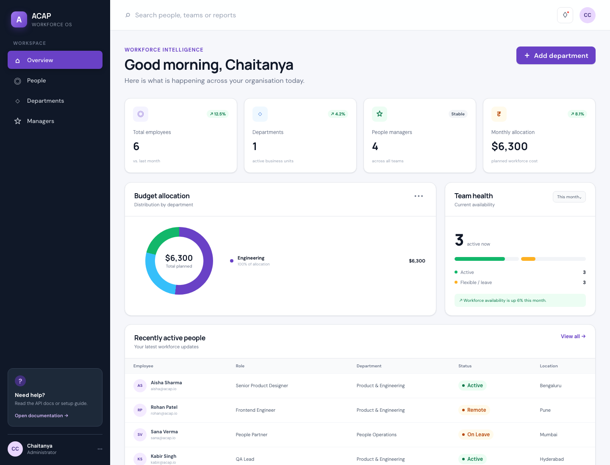
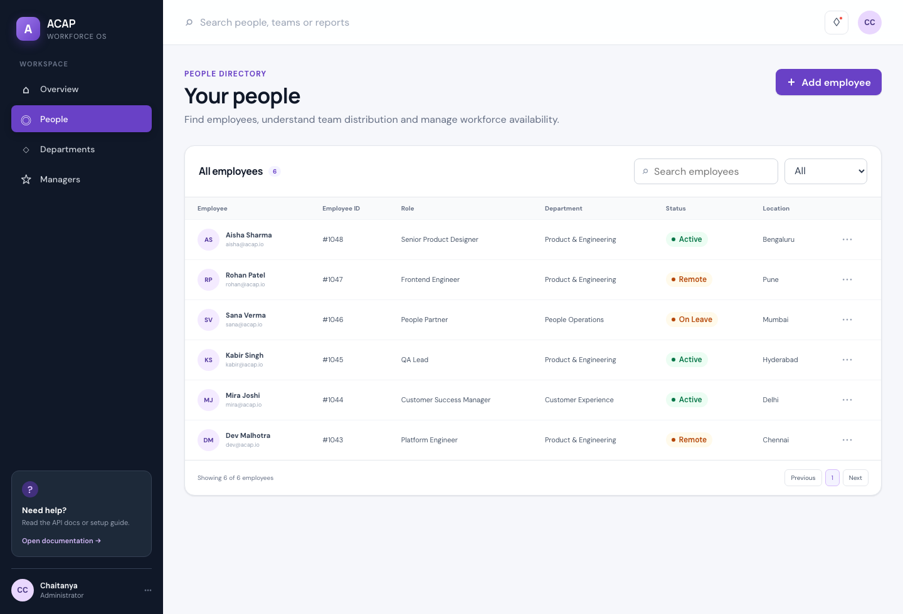
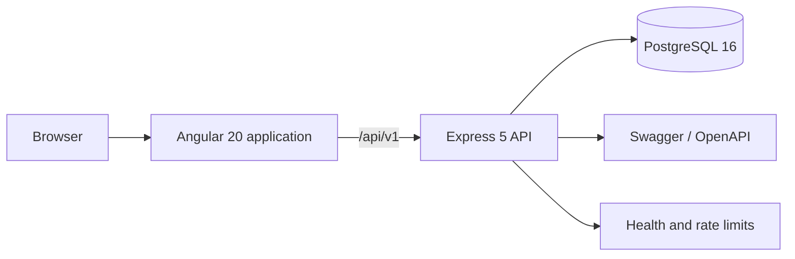

<div align="center">

# ACAP Workforce OS

**A responsive workforce planning platform for people, departments, leadership capacity and budget allocation.**

[](https://github.com/chaitanyachandla10/ACAP/actions/workflows/ci.yml)


</div>



## What ACAP does

ACAP gives operations and people teams one place to understand workforce composition. The application combines an Angular dashboard with a versioned Express API and PostgreSQL persistence.

- Executive dashboard with workforce, leadership, availability and allocation KPIs
- Searchable employee directory with team, status and location filters
- Department and leadership capacity planning
- Manager span-of-control and cost visibility
- Responsive navigation for desktop, tablet and mobile
- OpenAPI documentation, health checks and graceful degraded mode

## Product preview



## Architecture



The frontend uses lazy-loaded feature modules and a development proxy, so no localhost URL is compiled into application code. The API applies Helmet, origin allow-listing, request size limits, rate limiting, request IDs, centralized error handling and graceful shutdown.

## Run locally

### Prerequisites

- Node.js 20.19+, 22.12+, or 24+
- npm 10+
- PostgreSQL 14+ (optional for read-only demo mode)

```bash
git clone https://github.com/chaitanyachandla10/ACAP.git
cd ACAP
cp .env.example .env
npm ci
./start.sh
```

Open:

- Web application: <http://localhost:4200>
- API health: <http://localhost:3000/api/health>
- API documentation: <http://localhost:3000/api-docs/v1>

When PostgreSQL is unavailable, the API exposes a degraded health state and serves non-persistent demo reads so the product remains reviewable. Create operations return `503` and never claim that data was saved.

## Docker

```bash
docker compose up --build
```

This starts PostgreSQL and the production Node container. The production API serves the compiled Angular application at <http://localhost:3000>.

## Commands

| Command | Purpose |
| --- | --- |
| `npm start` | Angular development server with API proxy |
| `npm run start:api` | Express API |
| `npm run start:all` | Frontend and backend together |
| `npm run build` | Optimized production build |
| `npm test` | Headless Angular unit tests |
| `npm run check` | Production build plus tests |

## API surface

| Method | Endpoint | Description |
| --- | --- | --- |
| `GET` | `/api/health` | Runtime and database health |
| `GET` | `/api/v1/departments` | List departments |
| `POST` | `/api/v1/departments` | Create validated department plan |
| `GET` | `/api/v1/employees` | List employees |
| `GET` | `/api/v1/managers` | List manager allocations |

## Engineering standards

- Reproducible installs via `package-lock.json` and `npm ci`
- No dependencies or generated builds committed to Git
- CI build, unit tests and API smoke test on every pull request
- Environment-based database and CORS configuration
- Production image runs as a non-root user
- Lazy-loaded Angular features and production bundle budgets
- Five unit tests covering application boot, services, dashboard calculations and feature components

## Production checklist

Before a public deployment:

1. Store `DATABASE_URL` and other secrets in the deployment platform, never in Git.
2. Set `CORS_ORIGINS` to the exact frontend domain.
3. Put the service behind TLS and a managed reverse proxy.
4. Replace demo employee data with authenticated CRUD endpoints.
5. Add SSO/RBAC, audit events and database migrations before handling real employee data.
6. Pin a supported LTS Node version; odd-numbered Node releases are intentionally excluded.

## Roadmap

- Role-based access control and SSO
- Persistent employee and manager services with pagination
- Audit logs and approval workflows
- CSV import/export and scheduled reports
- Headcount forecasting and compensation bands
- Observability with structured logs, traces and error monitoring

## License

No license has been selected. Add one before external distribution.
